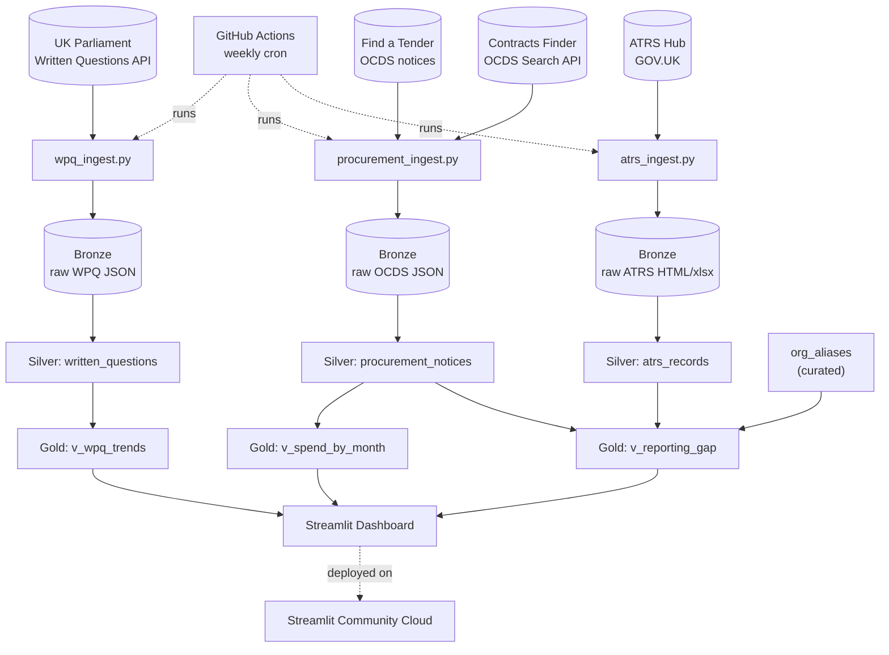

# UK Gov AI Observatory — Project Requirements Document

**Status:** Draft v0.1 — for review
**Date:** 13 June 2026
**Working title:** UK Gov AI Observatory (rename freely)
**Source input:** Gemini Deep Research report, *"Unified Public Sector AI Observatory"* — see **Appendix A** for corrections and caveats applied during this draft.

---

## 1. Vision & Problem Statement

UK government AI policy is announced loudly (compute pledges, sovereign AI funds, London Tech Week investment headlines) but deployed quietly, across dozens of departments and arm's-length bodies (ALBs), each with their own pace of disclosure. The only way to see the *real* picture — what's actually been bought, what's actually been registered as in-use, and what Parliament is actually asking about — is to pull from several independent, messy, public data sources and stitch them together.

This project builds a small, low-maintenance OSINT pipeline and dashboard that does exactly that: ingest UK government open data on algorithmic transparency (ATRS) and AI-related procurement, clean and normalise it, and surface the gap between "AI systems government has paid for" and "AI systems government has formally registered as in use." Parliamentary scrutiny and recruitment data extend the picture in later phases.

It's a personal/exploratory project first — a chance to build a real end-to-end data pipeline in Python, get hands-on with UK open government data standards (OCDS, ATRS), and produce something genuinely useful as a public-interest reference, with a possible secondary audience of journalists, researchers, or the civic-tech community if it's ever made public.

---

## 2. Goals

- **G1 — Ingest the two highest-signal sources reliably.** ATRS records (self-declared AI use) and Contracts Finder procurement notices (actual spend), on an automated schedule, with no manual steps.
- **G2 — Normalise into a small relational warehouse with provenance.** Every record carries its source URL and retrieval timestamp, so any number on the dashboard can be traced back to its origin.
- **G3 — Surface the "reporting gap."** For each department/ALB, compare AI-flagged procurement activity against ATRS registrations, computed live from current data (never hardcoded).
- **G4 — Provide a browsable, filterable dashboard.** Spend trends, registry entries, department-level comparisons, with sensible defaults and the ability to drill into individual records.
- **G5 (Phase 2+) — Add parliamentary scrutiny.** Written Parliamentary Questions (WPQs) mentioning AI, tagged by department and topic.
- **G6 (Phase 3, stretch) — Comparative compliance lens.** An illustrative mapping of known ATRS systems against EU AI Act risk tiers and the UK's five regulatory principles, framed explicitly as comparative analysis rather than a compliance audit.
- **G7 (Phase 3, stretch) — Recruitment signal.** Public sector AI/data hiring trends from free sources only.

---

## 3. MVP Success Criteria

- Ingestion pipeline runs unattended on a schedule (GitHub Actions) and is idempotent — re-running it doesn't duplicate records.
- ATRS and Contracts Finder feeds are ingested, deduplicated, and queryable via DuckDB.
- Dashboard (Streamlit) loads in a few seconds and shows, at minimum: a time series of AI-flagged contract value, a browsable ATRS record table, and a department-level "registered vs. AI-flagged spend" comparison.
- Total ongoing infrastructure cost: **£0** (free tiers only).
- A documented, versioned definition of "AI-relevant" (keyword list + CPV code ranges) that downstream metrics depend on — so the methodology is auditable, not a black box.

---

## 4. Scope

### 4.1 Phase 1 — MVP
- ATRS record ingestion (scrape ATRS Hub + parse linked Tier 1/Tier 2 spreadsheets)
- Contracts Finder OCDS ingestion, AI-relevance filtered
- Cleaning/normalisation per the data-quality playbook (§6.3)
- DuckDB warehouse, Bronze/Silver/Gold layout
- `org_aliases` curated lookup table (department name matching — see §6.7)
- Streamlit dashboard v1: spend trends, ATRS browser, department gap view
- GitHub Actions weekly scheduled run

### 4.2 Phase 2
- Find a Tender ingestion (higher-value contracts, OCDS)
- UK Parliament Written Questions ingestion, keyword-tagged
- Curated `compliance_comparison` table for ATRS systems of interest
- Dashboard v2: search/filter, WPQ trend view, comparative compliance view

### 4.3 Phase 3 — Stretch
- NLP/LLM-assisted classification (WPQ topic tagging; ATRS Tier 2 → illustrative risk-tier suggestion, human-reviewed)
- Public sector AI recruitment tracking (Civil Service Jobs only — see §6.6)
- Alerting (new ATRS record published; large AI-flagged contract awarded)
- Optional: Next.js/TypeScript frontend consuming Gold-layer exports, as a TS skill-building exercise

### 4.4 Out of scope
- Real-time/streaming ingestion — none of these sources update faster than daily, and most are far slower
- Multi-user accounts/auth — revisit only if the dashboard is published and needs personalisation
- Legal compliance determinations — the EU AI Act comparison is illustrative only (UK public bodies aren't bound by it; see §9 and Appendix A)
- Paid commercial data aggregators (Mantiks, Coresignal) and paid scraping platforms (Apify) — not unless you decide a small subscription is worth it later; not assumed here

---

## 5. Users & Use Cases

**Primary user:** you — as a working reference tool and a portfolio-quality data engineering project.

**Possible secondary audience:** researchers, journalists, civic-tech folks, *if* published.

Representative questions the dashboard should answer:

- "What AI-related contracts has DWP awarded in the last 12 months, and does DWP have a matching ATRS entry for the system involved?"
- "How is AI-flagged procurement spend trending over time, and which suppliers dominate?"
- "Which departments show the largest gap between AI-flagged spend and ATRS registrations?"
- *(Phase 2+)* "What is Parliament asking about AI this month, and which departments are fielding the most questions?"
- *(Phase 3)* "How does a given ATRS-registered system compare to EU AI Act risk tiers, illustratively?"

---

## 6. Data Sources & Methodology

### 6.1 Source overview

| Feed | Primary source | Access method | Auth | Cadence | Licence | Phase |
|---|---|---|---|---|---|---|
| Algorithmic transparency | GOV.UK ATRS Hub | Scrape collection page + parse linked Tier 1/2 docs/spreadsheets | None | Weekly/monthly | OGL v3.0 | 1 |
| Procurement (≥£12k) | Contracts Finder OCDS Search API | `GET /Published/Notices/OCDS/Search` | **None** | Daily/weekly | OGL v3.0 | 1 |
| Procurement (high value) | Find a Tender OCDS notices | OCDS notice download/search (verify exact endpoint at build time) | None for reading | Daily/weekly | OGL v3.0 | 2 |
| Parliamentary scrutiny | UK Parliament Written Questions API | REST/JSON, keyword + date filters | None | Daily/weekly | Open Parliament Licence | 2 |
| Recruitment | Civil Service Jobs | Scrape search results (respect robots.txt) | None | Weekly | OGL v3.0 (check site terms) | 3 |

### 6.2 ATRS — Algorithmic Transparency Records

**What it is:** Each ATRS submission is published as its own GOV.UK page under the [ATRS Hub collection](https://www.gov.uk/government/collections/algorithmic-transparency-recording-standard-hub), containing a Tier 1 plain-English summary and a linked Tier 2 technical spreadsheet (xlsx or Google Sheets template).

**Access:** No API. The collection page is the entry point — scrape it for links to individual record pages, then for each page:
- Parse Tier 1 fields from the page's HTML/embedded content (organisation, phase, one-sentence description, dates).
- Download and parse the Tier 2 spreadsheet for technical fields (model architecture, sensitive attributes, DPIA link).

**Known wrinkle:** `standard_version` varies across records (the template has been revised at least to v3/v4). The parser needs version-aware field mapping — don't assume every record has the same column layout. Build a small set of fixtures (one real record per version you encounter) and test against those.

**Key fields → `atrs_records` (Silver):**

| Field | Type | Notes |
|---|---|---|
| `record_id` | string (PK) | Derived from the GOV.UK URL slug |
| `organisation_name` | string | Free text — feeds `org_aliases` matching |
| `phase` | enum | Idea / Design / Beta / Production / Retired |
| `one_sentence_desc` | string | Tier 1 |
| `model_architecture` | string | Tier 2 |
| `sensitive_attributes` | string | Tier 2 — flags personal/protected-characteristic data |
| `dpi_assessment_url` | string \| null | Tier 2 — link to DPIA |
| `date_published` | date | |
| `standard_version` | string | e.g. "v3.0" |
| `source_url` | string | Provenance |
| `ingested_at` | timestamp | Provenance |

**Important:** don't hardcode a record count or "reporting gap %" anywhere — the pipeline should compute the current count on every run (see Appendix A, item 1).

### 6.3 Procurement — Contracts Finder OCDS (Phase 1 core)

**Endpoint:** `GET https://www.contractsfinder.service.gov.uk/Published/Notices/OCDS/Search`
**Auth:** **None.** Public, keyless, OGL v3.0. (The CDP-Api-Key endpoints from the source report are for contracting authorities submitting *their own* notices — not relevant to a read-only OSINT pipeline. See Appendix A, item 2.)
**Params:** `publishedFrom`, `publishedTo` (ISO datetimes), `stages` (comma-separated: `planning,tender,award,implementation`). Paginate through results.
**Returns:** OCDS release packages — `releases[]` array with tender/award/planning data, CPV codes, supplier info, values.

**Data-cleaning playbook** (carried over and lightly adapted from the source report — this table is genuinely useful):

| Issue | Impact | Mitigation |
|---|---|---|
| Supplier ID duplication | Sub-contractors/joint suppliers share identifiers; downstream dedup drops valid suppliers | Parse award arrays per-entry; key on supplier name + DUNS (where present), not a single shared ID |
| Empty supplier name fields | Obscures who received funds | Flag as `supplier_unknown`; optional Phase 2 cross-reference against Companies House by registration number |
| Anomalous date fields | Breaks timeline charts | Validate against `publishedDate`; if `end < start`, **flag the record** rather than silently imputing a value |
| Non-UTF-8 characters | Breaks JSON parsing / display | Force UTF-8 on ingest with explicit error handling (Python `codecs`) |
| Internal/dead document links | Users can't follow through | Store as-is, mark `link_status = 'unresolved'` — don't auto-scrape replacements (fragile, scope creep) |

**Output:** `procurement_notices` (Silver), `source = 'contracts_finder'`.

### 6.4 Procurement — Find a Tender (Phase 2)

For higher-value notices (the source report cites a ~£138,760 threshold for central government services — these thresholds are revised periodically, so verify the current figure at build time rather than treating it as fixed). Find a Tender publishes notice data in OCDS JSON under OGL, separately from the CDP-key submission API. The exact public search endpoint should be confirmed against current GOV.UK API docs when you start this phase — by then it may have converged further with Contracts Finder under the Procurement Act 2023 reforms.

Same AI-relevance filtering (§6.7) and cleaning playbook (§6.3) apply. Output: `procurement_notices`, `source = 'find_a_tender'`.

### 6.5 Parliamentary Written Questions (Phase 2)

**What it is:** UK Parliament's Written Questions and Answers service — a public REST/JSON API (the `hansard` and `clquestions` R packages both wrap it, but for a Python pipeline, call the REST API directly). Verify the current base URL/version against [api.parliament.uk](https://api.parliament.uk) at build time.

**Query approach:** date range + keyword search (`artificial intelligence`, `AI`, `algorithm`, `machine learning`, plus department-specific terms) using the shared keyword config from §6.7.

**Key fields → `written_questions` (Silver):**

| Field | Type | Notes |
|---|---|---|
| `question_id` | string (PK) | UIN |
| `house` | enum | Commons / Lords |
| `date_tabled` | date | |
| `date_answered` | date \| null | |
| `member_name` | string | |
| `department` | string | feeds `org_aliases` |
| `question_text` | string | |
| `answer_text` | string \| null | |
| `ai_relevance_flag` | bool | from §6.7 keyword match |
| `topic_tags` | json array | Phase 3, NLP-assigned |
| `source_url`, `ingested_at` | | Provenance |

**Licence note:** Parliamentary data is published under the **Open Parliament Licence**, which is similar to but distinct from OGL v3.0 — attribute separately.

### 6.6 Human Capital / Recruitment (Phase 3, optional)

The source report proposes Apify scraping plus commercial aggregators (Mantiks, Coresignal). Both are paid products and don't fit a £0-infrastructure personal project — **recommendation: drop these for now.**

If you want this signal at all, **Civil Service Jobs** (`civilservicejobs.service.gov.uk`) is the UK government's own recruitment portal and a much better fit: free, directly relevant (it's specifically civil service roles, vs. DWP FindAJob's general public listings), and likely scrapable with reasonable politeness (respect `robots.txt`, low request rate, cache results). Treat this as genuinely optional — it's the weakest-signal feed relative to its effort cost.

### 6.7 Cross-cutting concern #1: defining "AI-relevant"

None of these sources tag records as "AI" — that determination is *yours to make*, and it's the single methodological choice that most affects every downstream metric. Define it once, in a versioned config file (e.g. `config/ai_relevance.yaml`):

- A keyword list (`artificial intelligence`, `machine learning`, `algorithm`, `generative AI`, `LLM`, `automated decision`, etc.)
- A CPV code range for IT/software/R&D categories (broadly the `72xxxxxx` and `48xxxxxx` ranges, refined as you go)
- A version number — store this version alongside each record's relevance flag, so if you tighten or loosen the definition later, historical dashboard views remain explainable rather than silently shifting.

Start narrow, manually spot-check a sample of matches and near-misses, and widen deliberately. Document the current definition on the dashboard itself — this is the kind of methodological transparency the project is *about*, so it should practice it too.

### 6.8 Cross-cutting concern #2: the `org_aliases` problem

The "reporting gap" (G3) requires joining ATRS `organisation_name` ("Department for Work and Pensions") against OCDS `buyer.name` ("DWP", "Department for Work & Pensions — Shared Services", etc.). These will **not** match cleanly. This needs a small, manually curated lookup table:

```
org_aliases(raw_name TEXT, canonical_name TEXT, org_type TEXT)
```

Seed this with the ~20–25 departments/major ALBs that account for most AI-related activity (DWP, HMRC, NHS England, MoJ/HMPPS, Home Office, DSIT, ONS, Natural England, etc.). This is genuinely a Phase 1 task, not an afterthought — without it, `v_reporting_gap` will be mostly noise.

---

## 7. System Architecture

### 7.1 Tech stack recommendation

**Recommended: Python + DuckDB + Streamlit + GitHub Actions.**

This project is overwhelmingly a data engineering exercise — scraping, API integration, cleaning, cross-referencing, light NLP later. That's squarely Python's strengths, and it's where you're strongest too. Concretely:

- **Ingestion:** Python (`requests`, `pandas`, `openpyxl` for ATRS spreadsheets, `beautifulsoup4` for the ATRS Hub collection page).
- **Warehouse:** **DuckDB** — embedded, file-based, zero administration (no server to run, patch, or schedule maintenance for — directly addressing the DB-admin gap you flagged), but genuinely SQL-native with proper analytical SQL (window functions, etc.), which is exactly what "spend by month" and "gap by department" views need. It also reads/writes Parquet natively, which maps cleanly onto the Bronze/Silver/Gold layout below. If DuckDB feels like one new thing too many to start, SQLite is a perfectly reasonable fallback for Phase 1 — but DuckDB is a better long-term fit for this *kind* of workload and a good way to build more advanced SQL fluency in a low-stakes setting.
- **Dashboard:** **Streamlit** — entire dashboard in Python, reading directly from the DuckDB file. No separate API layer, no frontend framework, fast iteration.
- **Orchestration:** GitHub Actions scheduled workflow (free), running ingestion scripts and committing updated data back to the repo.
- **Hosting:** Streamlit Community Cloud (free), deployed from the same repo.

**On Next.js/TypeScript:** I know you've been building TS fluency via the badger PWA, and it's a stated priority. The reason I'm *not* recommending it for V1 here isn't that it's a bad idea — it's that this project's value is almost entirely in the data pipeline, and bolting on a Next.js frontend for V1 means building a data API layer (still likely Python/FastAPI) *and* a TS frontend before you have anything to show. That's a lot of plumbing between you and the interesting OSINT work.

The architecture below keeps Gold-layer data in plain DuckDB/Parquet, independent of Streamlit. That means a Next.js frontend remains a genuinely viable **Phase 4** — it'd consume the same Gold-layer exports (via static JSON generation or a thin FastAPI wrapper) without redoing any of the ingestion/cleaning work. Streamlit now doesn't foreclose Next.js later; it just sequences "build the hard part" before "build a nicer frontend for it."

### 7.2 Architecture diagram



### 7.3 Bronze / Silver / Gold design

- **Bronze:** Per-run raw snapshots (JSON/HTML/Parquet), stored under `data/bronze/<source>/<run_date>/`. Append-only, cheap, enables replay if Silver logic changes without re-hitting the source.
- **Silver:** DuckDB tables (`atrs_records`, `procurement_notices`, `written_questions`, `org_aliases`). Each source's ingestion script owns its upsert logic into its own table(s) — keep these independent so one feed failing doesn't break another.
- **Gold:** DuckDB **views** (not materialised tables) computed from Silver — `v_reporting_gap`, `v_spend_by_month`, `v_wpq_trends`. At this data volume, views are always "live" relative to Silver with no separate materialisation step.

### 7.4 Orchestration & scheduling

GitHub Actions workflow on a weekly cron (e.g. Monday mornings — none of these sources change fast enough to need daily runs for an MVP). Steps: checkout → set up Python → run each ingestion script independently → run Silver upserts → commit updated DuckDB/Parquet files back via a bot commit.

**One thing to watch:** a committed `.duckdb` file as a binary blob will diff/grow poorly in git over time. At MVP scale (low thousands of rows) this is fine; if the repo gets unwieldy, switch to committing Silver/Gold as Parquet files (DuckDB queries Parquet directly, no persistent file needed) or move to git-lfs.

### 7.5 Hosting

Streamlit Community Cloud, free tier, deployed from the GitHub repo. No secrets required for Phase 1/2 — every source above is keyless. If Phase 3 introduces an LLM API for classification, manage that key via Streamlit secrets / GitHub Actions secrets, never committed to the repo (you've already got good instincts here from the Vercel env-var debugging on the badger PWA).

---

## 8. Data Model (Silver layer)

```
atrs_records
├── record_id (PK)
├── organisation_name
├── phase                 -- enum: Idea/Design/Beta/Production/Retired
├── one_sentence_desc
├── model_architecture
├── sensitive_attributes
├── dpi_assessment_url
├── date_published
├── standard_version
├── source_url
└── ingested_at

procurement_notices
├── notice_id (PK)        -- OCID + release id
├── source                -- 'contracts_finder' | 'find_a_tender'
├── stage                 -- planning/tender/award/implementation
├── title
├── description
├── value_amount
├── currency
├── buyer_name
├── buyer_org_id
├── supplier_name
├── supplier_id           -- DUNS where available
├── cpv_codes             -- json array
├── published_date
├── contract_start / contract_end
├── ai_relevant           -- bool, from §6.7
├── ai_relevance_version  -- which config version flagged it
├── link_status           -- 'ok' | 'unresolved'
├── source_url
└── ingested_at

written_questions          -- Phase 2
├── question_id (PK)
├── house
├── date_tabled / date_answered
├── member_name
├── department
├── question_text
├── answer_text
├── ai_relevance_flag
├── topic_tags            -- json array, Phase 3
├── source_url
└── ingested_at

org_aliases                -- curated, Phase 1
├── raw_name (PK)
├── canonical_name
└── org_type

compliance_comparison      -- curated, Phase 2/3
├── atrs_record_id (FK)
├── eu_ai_act_risk_tier    -- illustrative
├── uk_principles_at_risk  -- json array
├── notes
└── last_reviewed
```

**Gold views (examples):**
- `v_reporting_gap` — per `canonical_name`, count of AI-relevant procurement notices vs. count of ATRS records, joined via `org_aliases`
- `v_spend_by_month` — sum of `value_amount` for AI-relevant notices, by month and `canonical_name`
- `v_wpq_trends` — WPQ volume over time, by department and topic tag

---

## 9. Comparative Compliance Mapping (Phase 2/3)

**Framing correction (important):** the EU AI Act does not legally bind UK public sector bodies post-Brexit. This feature should be presented as an **illustrative comparison** — "if this system were assessed under the EU's risk-tier framework, here's roughly where it'd sit, and how that compares to the UK's own five principles (safety, transparency, fairness, accountability, contestability)" — not as a finding of non-compliance with applicable law. The dashboard should say this explicitly wherever this view appears.

**Phase 2 approach:** a small, manually curated `compliance_comparison` table covering ATRS systems you find genuinely interesting (likely a handful — high-risk-feeling systems in welfare, biometrics, criminal justice, social care). This is inherently qualitative and your own analysis; present it as such.

**Phase 3 (optional):** explore semi-automation — e.g. rules based on `sensitive_attributes` + sector suggesting a likely risk tier, or an LLM-assisted first pass that you review and edit. Keep a human in the loop given the qualitative nature of the judgement.

---

## 10. Non-Functional Requirements

- **Cost:** £0/month target for Phases 1–2. If Phase 3 adds an LLM API for classification, cap spend (e.g. <£5/month) via batching and caching — classify once per record, not on every dashboard load.
- **Freshness:** weekly is sufficient for every source here; none of this data moves fast enough to justify daily polling for an MVP.
- **Reliability:** each ingestion script independently runnable and idempotent. A failure in one feed shouldn't block the others. GitHub Actions failure notifications (email) are enough monitoring for a personal project.
- **Provenance:** every Silver row carries `source_url` and `ingested_at`. Bronze snapshots retained for reproducibility/debugging.
- **Licensing & attribution:** OGL v3.0 attribution on the dashboard footer for GOV.UK-sourced data; separate Open Parliament Licence attribution for WPQ data once Phase 2 lands.
- **Scraping etiquette:** the only scraping here is the ATRS Hub collection page (low-volume, public information pages — fine) and, in Phase 3, Civil Service Jobs (respect `robots.txt`, low request rate).
- **Security:** no secrets for Phases 1–2. Any future API keys via Streamlit/GitHub secrets, never committed.
- **Maintainability:** modular per-source scripts, shared `common/` utilities (HTTP client with retries, DuckDB connection helper, `org_aliases` lookup).

---

## 11. Risks & Mitigations

| Risk | Mitigation |
|---|---|
| ATRS Hub page structure changes (it's actively iterated — last updated May 2025 per GOV.UK changelog) | Defensive parsing, snapshot-based tests against real fixtures, alert on parse failures rather than failing silently |
| `org_aliases` is incomplete → false "gaps" | Curate iteratively; present gap metrics with an explicit "X organisations unmatched" caveat on the dashboard |
| AI-relevance keyword/CPV filter produces false positives/negatives | Start narrow, version the definition (§6.7), spot-check samples manually before trusting trend lines |
| Scope creep across 4 feeds + NLP + compliance mapping | Strict phasing — Phase 1 is ATRS + Contracts Finder *only* |
| Headline stats (gap %, record counts) go stale or get over-quoted | Always compute live from current data; never hardcode a number from a report or blog post |
| EU AI Act comparison misread as a legal compliance finding | Explicit "illustrative comparison" framing wherever shown (§9) |
| Find a Tender's exact public read endpoint may have shifted under Procurement Act 2023 reforms | Verify against current GOV.UK API docs at the start of Phase 2, not from this document |

---

## 12. Open Questions

A few things only you can answer, and that would shape priorities:

1. **Personal-only, or eventually public?** Affects how much polish the "limitations/methodology" framing needs, and whether hosting robustness matters beyond "works for me."
2. **Is weekly the right cadence**, or would monthly suffice given how slowly ATRS and procurement data actually move? (Lower cadence = less to maintain.)
3. **Any appetite at all for a small paid component** (e.g. a few pounds/month for LLM-assisted classification in Phase 3), or strictly free-tier throughout?
4. **Is the Phase 4 Next.js frontend something you actually want**, or is Streamlit fine long-term? (No need to decide now — just affects whether it's worth keeping Gold-layer exports format-agnostic from day one, which costs almost nothing either way.)
5. **Drop "Human Capital" entirely**, or is Civil Service Jobs scraping (free) worth the effort for the signal it'd add?

---

## 13. Phased Roadmap

| Phase | Contents | Relative effort |
|---|---|---|
| 0 — Foundation | Repo scaffold, DuckDB setup, shared utils, seed `org_aliases` and `ai_relevance.yaml` | Small |
| 1 — MVP | ATRS scraper, Contracts Finder ingestion, cleaning, Gold views, Streamlit v1, weekly GH Actions | **Core — largest single chunk** |
| 2 | Find a Tender, WPQ ingestion, curated compliance table, dashboard v2 (search/filter) | Medium |
| 3 — Stretch | NLP/LLM classification, Civil Service Jobs feed, alerting, optional Next.js frontend | Large, optional |

---

## Appendix A: Corrections & Caveats vs. Source Report

1. **"59 ATRS records / 97% reporting gap" is stale (~13 months old).** This figure traces to a GDS blog post from May 2025, which states the total reached 59 *at that time* after 53 additions in the prior year, and that "more ATRS records are added each month." The real count in June 2026 is almost certainly higher, and the gap percentage with it. The dashboard's ingestion pipeline should compute this live — ironically, "how many records are currently on the ATRS Hub" is a good first thing for it to tell you.

2. **The "CDP-Api-Key" value in the source report is GOV.UK's own documentation placeholder**, not a leaked credential — it appears verbatim (`YbHJy1zPfMgDfa9npEDBtZ05ji0w2OM7M`) throughout the official Find a Tender API how-to guide's curl examples. More substantively, though: the endpoints that key gates (`/notice/submission/...`) are for *contracting authorities submitting and checking their own notices* — an entirely different access pattern from a third party reading published data. For reading, Contracts Finder's `/Published/Notices/OCDS/Search` endpoint is public and keyless under OGL v3.0. This PRD's §6.3 reflects the corrected approach.

3. **Internal inconsistency in the WPQ statistics.** The report's body text states the October 2025 peak was 777 written questions per sitting day; the dashboard mockup states "604 Written Questions/Sitting Day." These don't reconcile. Treat the report's specific headline numbers as illustrative rather than as values to reproduce.

4. **EU AI Act fine figures are roughly right but compress a tiered structure.** The Act's actual penalty structure has multiple tiers — up to €35m/7% of global turnover for the most serious (prohibited-practice) violations, with lower tiers (€15m/3%, €7.5m/1%) for other breaches. The report's "€30–35 million or 6–7%" doesn't map cleanly onto these bands. If exact figures matter for the dashboard, pull them from the Regulation (EU) 2024/1689 text directly.

5. **London Tech Week 2026 figures check out well.** LTW2026 ran 8–12 June 2026 (i.e., concluded just before this PRD was drafted), and coverage from its closing days corroborates the report's headline figures: AMD's £2bn five-year UK commitment, Nebius's ~£1.7bn UK expansion, the £400m specialist AI chip fund, the £500m Sovereign AI programme (announced by DSIT in March 2026), and a skills programme citing 1.7 million course completions. Some attributions have nuance worth a second look if used as headline stats — e.g., British firm Ark's £807m Longcross Park expansion is what *enables* Nebius's deployment there, so "Nebius £1.7bn / Ark Longcross Park" in the report's mockup conflates two related-but-distinct announcements.

6. **The "21 → 420 ExaFLOPs by 2030" and "1.7M / 10M skills" targets are plausible but unverified against a specific primary source.** A 20x compute expansion narrative and the 1.7M skills-completions figure both align with things found during this research, but neither was traced to a single authoritative document. If used on the dashboard, source them properly rather than treating this PRD's mention as confirmation.

7. **Named ATRS examples (Survey Assist, nDelius Semantic Search, Parlex, EPS Assist Me, etc.) are plausible** — nDelius, for instance, is a real MoJ probation case-management system, so an AI add-on to it isn't far-fetched — but a couple of the cited publication dates sit right at the edge of (or just past) the source report's apparent generation point. Verify specific entries against the live ATRS Hub rather than assuming this list is current; it's a useful sense of *what kind* of tools get registered, not a snapshot to reproduce.
